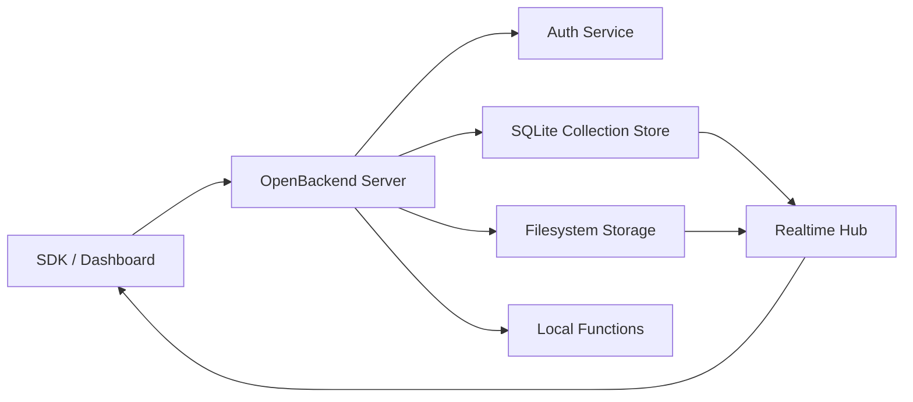

# Architecture

OpenBackend is a local-first backend platform with small, separable modules. The default mode runs entirely on one machine with SQLite, filesystem storage, local functions, and WebSocket realtime updates. The same boundaries are intended to support PostgreSQL, MinIO, and clustered deployments later.

## bMAD Breakdown

### 1. Product Modules

- Database: document collections over SQLite now; PostgreSQL adapter later.
- Realtime: WebSocket event bus that broadcasts collection and file events.
- Auth: self-hosted identities, password hashes, sessions, and API keys.
- Storage: local filesystem object storage, later S3-compatible and MinIO adapters.
- Functions: local server-side function registry with HTTP trigger support.
- Dashboard: admin UI for collections, users, files, logs, and function triggers.
- SDK: TypeScript client for REST and WebSocket workflows.
- DevOps: Docker Compose, local data volume, backup/export hooks.

### 2. User-Facing Behavior

- Start a local backend with one command.
- Create a collection by writing the first document or through the dashboard.
- Insert, update, delete, list, and watch documents.
- Register users, log in, log out, and use API keys for devices.
- Upload and download files through stable object IDs.
- Run local functions without cloud deployment.
- Export/import local data for backups, migration, and NAS workflows.

### 3. Open-Source Alternatives

- SQLite: excellent embedded database for local-first single-node mode.
- PostgreSQL: proven multi-user server database and future replication target.
- LiteFS/ElectricSQL/RxDB/PouchDB/CouchDB/PocketBase: useful reference points for sync, local-first UX, and embedded backend ergonomics.
- Yjs/Automerge: future CRDT candidates for collaborative documents.
- Supabase Realtime: useful public design reference for event fanout patterns.
- Lucia/Auth.js/Ory Kratos/SuperTokens: reference points for self-hosted identity.
- MinIO: target S3-compatible storage deployment.
- OpenFaaS/serverless-http/Deno/Node workers: function runtime inspirations.
- React/Vite/Tailwind/shadcn/ui: dashboard stack candidates.
- FastAPI/Hono/Express/NestJS/tRPC: API framework candidates.

### 4. Original Implementation

The MVP uses Hono on Node.js because it keeps HTTP APIs small, typed, and easy to ship locally. SQLite stores JSON documents in a collection table with revision metadata. The realtime package owns a WebSocket hub and broadcasts normalized events after writes. Auth and storage are package-level services consumed by the server app.

No public API copies protected hosted-backend product names. The SDK uses original entry points such as `createOpenBackend`, `database`, `collection`, `create`, and `watch`.

### 5. Modular Code

Each package exposes a narrow service:

- `@openbackend/database`: collection CRUD, revisions, export/import.
- `@openbackend/realtime`: event hub and socket lifecycle.
- `@openbackend/auth`: identities, passwords, sessions, API keys.
- `@openbackend/storage`: local object write/read/delete.
- `@openbackend/functions`: local function registration and invocation.
- `@openbackend/sdk-js`: browser and Node client.

### 6. Improvements Beyond Common Hosted Backend Models

- Database: local-first SQLite with planned offline write queues and conflict metadata.
- Auth: built-in self-hosted identity, no required external provider.
- Storage: first-class NAS/local disk support.
- Functions: run locally during development and production.
- Dashboard: planned one-click export/import.
- SDK: planned migration helpers for common REST/hosted-backend patterns.
- DevOps: Docker Compose with bind-mounted data.
- Backups: planned scheduled local backup to external drive or NAS.

## Request Flow

## Scaling Path

1. Laptop: SQLite, local disk, local functions.
2. NAS: Docker Compose, mounted storage volume, scheduled backups.
3. VPS: PostgreSQL, MinIO, TLS proxy, externalized function workers.
4. Team/server mode: permission policies, audit logs, replication, and queue-backed events.

